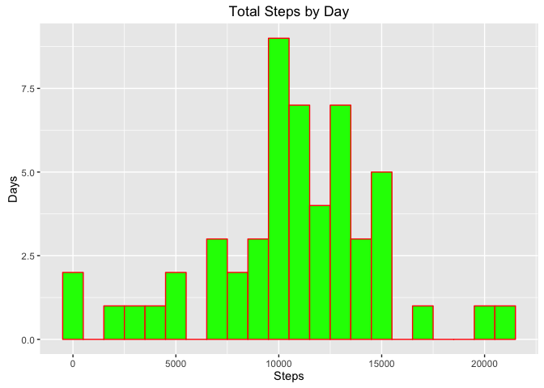
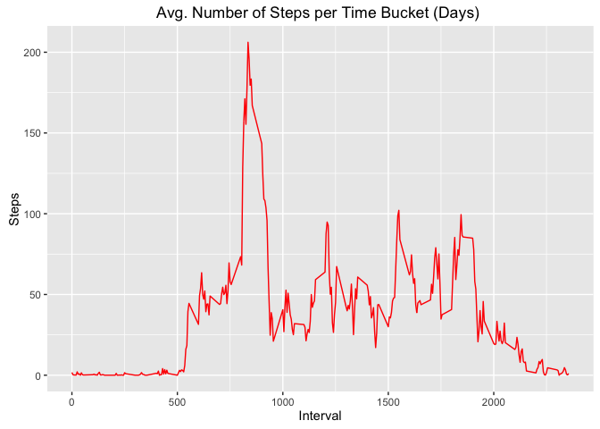
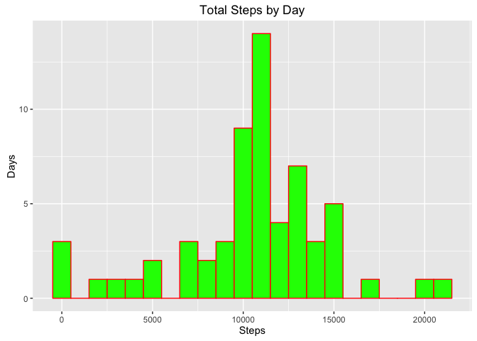
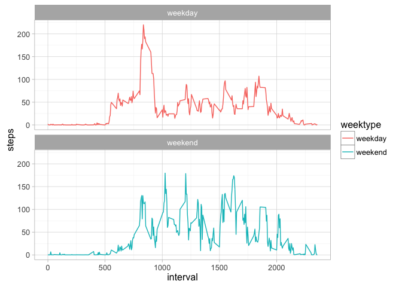

# Reproducible Research: Peer Assessment 1
jguszr  
25 de outubro de 2016  


## Loading and preprocessing the data

I prefer to use Dplyr and GGPLOT2 instead of the base plot system, and Dplyr to some data manipulation

```r
require(ggplot2)
```

```
## Loading required package: ggplot2
```

```r
require(dplyr)
```

```
## Loading required package: dplyr
```

```
## 
## Attaching package: 'dplyr'
```

```
## The following objects are masked from 'package:stats':
## 
##     filter, lag
```

```
## The following objects are masked from 'package:base':
## 
##     intersect, setdiff, setequal, union
```


### Synopsis
The project objective in practice are :

* load and prepare the indicated data 
* handle missing values
* interpreting data 


## Data
The data for this assignment was provided by the course web site
site:
* Dataset: [Activity monitoring data](https://d396qusza40orc.cloudfront.net/repdata%2Fdata%2Factivity.zip) [52K]


The dataset is stored in a CSV file and there are  17,568 observations.

The variables included in this dataset are:

* **interval**: Identifier for the 5-minute interval in which
    measurement was taken
* **date**: The date on which the measurement was taken in YYYY-MM-DD
    format
* **steps**: Number of steps taking in a 5-minute interval (missing
    values are coded as `NA`)

## What is mean total number of steps taken per day?

The dataset is stored in a CSV file and there are  17,568 observations.

## Loading and preprocessing the data

Download, unzip and load data into data frame `data`. 

```r
if(!file.exists("getdata-projectfiles-UCI HAR Dataset.zip")) {
        download.file("http://d396qusza40orc.cloudfront.net/repdata%2Fdata%2Factivity.zip",
                      destfile="getdata-projectfiles-UCI HAR Dataset.zip",method="curl")  
        unzip("getdata-projectfiles-UCI HAR Dataset.zip" )
        
}

data <- read.csv("activity.csv")
```

get a Gist of the data structure 


```r
str(data)
```

```
## 'data.frame':	17568 obs. of  3 variables:
##  $ steps   : int  NA NA NA NA NA NA NA NA NA NA ...
##  $ date    : Factor w/ 61 levels "2012-10-01","2012-10-02",..: 1 1 1 1 1 1 1 1 1 1 ...
##  $ interval: int  0 5 10 15 20 25 30 35 40 45 ...
```

Check some rows :

```r
head(data)
```

```
##   steps       date interval
## 1    NA 2012-10-01        0
## 2    NA 2012-10-01        5
## 3    NA 2012-10-01       10
## 4    NA 2012-10-01       15
## 5    NA 2012-10-01       20
## 6    NA 2012-10-01       25
```


## What is the average daily activity pattern?

Sum steps by day, create Histogram, and calculate mean and median.

```r
steps_by_day <- aggregate(steps ~ date, data, sum)

qplot(steps_by_day$steps,
      geom="histogram", 
      binwidth = 1000,
      main = "Total Steps by Day",
      xlab = "Steps",
      ylab = "Days",
      fill=I("green"),col=I("red"))
```

<!-- -->

```r
rmean <- mean(steps_by_day$steps)
```
`mean` : 1.0766189\times 10^{4} 
 

### What is the average daily activity pattern?

* Average steps for each interval for the whole set of days. 
* Plot the Average Number Steps per Day by time bucket . 
* Find time buckets  with most average steps. 


```r
steps_by_interval <- aggregate(steps ~ interval, data, mean)

qplot(steps_by_interval$interval,
      steps_by_interval$steps, 
      geom = "line", 
      xlab="Interval", 
      ylab="Steps",
      main="Avg. Number of Steps per Time Bucket (Days) ",
      col=I("red")
      )
```

<!-- -->

```r
mInt <- steps_by_interval[which.max(steps_by_interval$steps),1]
```

The  average number of steps per time bucket interval (wich maximum number of steps): 835.


## Imputing missing values

### handle missing values. Compare imputed to non-imputed data.
Missing data needed to be imputed. 

```r
incomplete <- sum(!complete.cases(data))
imputed_data <- transform(data, 
                          steps = ifelse(is.na(data$steps), 
                                         steps_by_interval$steps[match(data$interval, 
                                        x = steps_by_interval$interval)], data$steps))
```

Zeroes were imputed for 10-01-2012 because it was the first day and would have been over 9,000 steps higher than the following day, which had only 126 steps. NAs then were assumed to be zeros to fit the rising trend of the data. 

```r
imputed_data[as.character(imputed_data$date) == "2012-10-01", 1] <- 0
```

Recount total steps by day and create Histogram. 

```r
stepsByDay <- aggregate(steps ~ date, imputed_data, sum)

qplot(stepsByDay$steps,
      geom="histogram",
      binwidth = 1000,
      main = "Total Steps by Day",
      xlab = "Steps",
      ylab = "Days",
      fill=I("green"),col=I("red"))
```

<!-- -->

Calculate new mean and median for imputed data. 

```r
rmean.i <- mean(stepsByDay$steps)
rmedian.i <- median(stepsByDay$steps)
```


## Are there differences in activity patterns between weekdays and weekends?

```r
data_fulll <- data
nas <- is.na(data_fulll$steps)
avg_interval <- tapply(data_fulll$steps, data_fulll$interval, mean, na.rm=TRUE, simplify=TRUE)
data_fulll$steps[nas] <- avg_interval[as.character(data_fulll$interval[nas])]

## since Im from Brazil, my computer calendar follow the Brazilan portugues so, Sabado means Saturday
## and Sunday means Domingo

data_fulll <- mutate(data_fulll, weektype = ifelse(weekdays(as.Date(data_fulll$date)) == "Sabado" | weekdays(as.Date(data_fulll$date)) == "Domingo", "weekend", "weekday"))

data_fulll$weektype <- as.factor(data_fulll$weektype)
```

### And now the chart

```r
interval_full <- data_fulll %>%
  group_by(interval, weektype) %>%
  summarise(steps = mean(steps))
s <- ggplot(interval_full, aes(x=interval, y=steps, color = weektype)) +
  geom_line() + scale_fill_grey() + theme_light() +
  facet_wrap(~weektype, ncol = 1, nrow=2)
print(s)
```

<!-- -->

## Disclaimer

References :

*  [GGPlot2 Tutorial](http://www.sthda.com/english/wiki/qplot-quick-plot-with-ggplot2-r-software-and-data-visualization)

*  [DPlyr Reference ](https://cran.rstudio.com/web/packages/dplyr/vignettes/introduction.html)

* More references of Stackoverflow that I can possible list [R on Stack overflow ](http://stackoverflow.com/questions/tagged/r)


